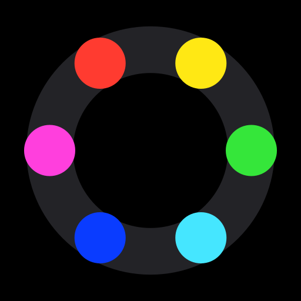

# Score It

A scorekeeper for 1–12 players that works the way a scorekeeper should: press a
player's dot and swipe around the ring. No accounts, no network, no build step —
one static page you can host on GitHub Pages.



## How it works

| Gesture | Result |
| --- | --- |
| **Press a dot and swipe around the ring** | Dials that player's score up (clockwise) or down (counter-clockwise). The dot follows your finger and trails the player's color behind it; the middle shows the pending change and the player's own label shows what their total will be. Lift your finger and the dot winds back to its seat. |
| **Tap a name or score** | Rotates it 90° — so scores face whoever is sitting on that side of the table |
| **Long-press a score** (or right-click it) | Type a number instead: **Add points** for a round's tally, or **Set total** to copy a score over. The − button stands in for the minus key phone number pads don't have. It goes into the history as one move, so it undoes like a swipe. Each total in the ⚙︎ sheet opens the same thing. |
| **⚙︎ (top right)** | Add or remove players, rename them, pick any color, set the score step and sensitivity, turn haptics, the tick sound and keep-screen-on on or off, reset scores |
| **☰ (top left)** | Score history with undo and redo |

**Score step** sets how much each stop on the ring is worth — 1, 5, 10, 25 or 50 — so a
game scored in 25s takes the same flick as one scored in 1s. **Sensitivity** is a
separate thing: how many stops there are in a full turn of the ring (6–24), which
is how far your thumb travels per point.

You can swipe anywhere — outside the ring, or straight across the middle. The
dial tracks how far your finger has travelled around it rather than where it is,
so it keeps counting wherever your hand goes and never jumps when you cross the
centre.

One swipe is one entry in the history, so undo takes back the whole move rather
than unwinding it a point at a time. Everything is stored in `localStorage` on
the device — the game is still there when you come back.

**Keep screen on** (on by default) holds a screen wake lock while the app is in front, so
the phone doesn't dim and lock between turns. The browser lets go of it whenever the app
is hidden, so it is taken again on the way back. Browsers without the Wake Lock API
(iOS before 16.4) don't show the switch.

## Any screen

It is built phone-first but it is not stuck there. `metrics()` in `app.js` takes the
viewport and the two rows of labels and returns the whole layout: how wide the column
is, how tall a label is, how many columns each row gets, and the type sizes. The
column's width follows the screen's *height*, because the dial is a square in a
height-bound stack — on a 27" display it opens out to a 892px ring with 128px digits,
and it stops at 920px, past which a bigger ring is a longer reach rather than an easier
one. Given the width, a row of labels collapses to a single line instead of wrapping,
which is what buys the dial its height back on a landscape iPad or a laptop. Labels are
held to a little over half the column so the dial always wins the rest, and only their
*height* is capped — the name keeps its full width, so a short window shrinks the digits
rather than clipping the names.

Two things then size the totals. The label's height says how big a number *may* be; the
column's width says how big it *can* be. Digits are tabular, so the longest total on the
board sets the size for everyone — a scoreboard whose numbers are different sizes reads
as broken — and a total that gains a digit re-fits the type on the spot rather than
running into its neighbours. Only the type is touched there, because rebuilding the
labels would swallow the score's pop.

`metrics()` is pure, and `tools/check-sizes.mjs` lifts it straight out of `app.js` and
prints the resulting layout for a spread of phones, tablets and desktops at 1–12 players
and at 1-, 3- and 5-digit totals. It cannot drift from what ships, it fails loudly if a
layout would collide, and it is the fastest way to see what a change to the sizing does
everywhere at once.

Hover states are behind `(hover: hover) and (pointer: fine)`, so a tablet never gets a
dot stuck in its hover state after a tap. Above 700px the sheets lift off the bottom
edge and float with all four corners rounded.

## Run it locally

It is plain HTML, CSS and JavaScript; no install, no dependencies.

```sh
python3 -m http.server 8000
# then open http://localhost:8000
```

## Put it on GitHub Pages

```sh
git init
git add .
git commit -m "Score It"
git branch -M main
git remote add origin git@github.com:<you>/<repo>.git
git push -u origin main
```

Then in the repository: **Settings → Pages → Source: Deploy from a branch →
`main` / `/ (root)`**. It publishes at `https://<you>.github.io/<repo>/` within a
minute or two.

Every path in the project is relative, so it works from a repository subpath as
well as a custom domain. The empty `.nojekyll` file tells Pages to serve the
files as-is.

On a phone, use **Share → Add to Home Screen** — it launches full screen with no
browser chrome.

## Offline and updates

`sw.js` is a service worker that keeps a copy of every file, so after the first visit
the app opens with no connection at all. It asks the network first and only falls
back to that copy when the request fails or takes more than three seconds, so a push
to `main` reaches phones on their next launch — there is no cache version to bump.
Every good response also refreshes the stored copy, which keeps the offline version
current. A new file the page loads must also be added to `FILES` in `sw.js`, or it
won't be there offline until it has been fetched once.

## Files

```
index.html      markup and the inline SVG ring
styles.css      the whole theme; sizes come from CSS custom properties
app.js          state, the swipe engine, rendering, persistence
sw.js           service worker: offline copy, network-first updates
tools/          node tools/make-icons.mjs   regenerates the PNG icons
                node tools/check-sizes.mjs  prints the layout table per screen
```

Two details worth knowing if you edit `app.js`:

- Swipes accumulate the **shortest arc** between pointer samples
  (`((d + 540) % 360) - 180`). Diffing raw angles instead would make the score
  jump by a full revolution as the finger crosses the 180° mark.
- Each segment is walked in short steps and every step is capped at the angle its
  travel could plausibly sweep at that radius, with the radius floored at 20% of
  the dial (`HUB`). Far from the centre the cap never bites and this is just the
  shortest arc; near the centre it is what stops a millimetre of wobble from
  spinning the dial, and what lets the finger cross the middle safely.
- The dot's angle is written straight from the finger on every `pointermove`, so
  it cannot lag. `requestAnimationFrame` is used only for the rewind on release,
  which carries a `setTimeout` guard so a frame that never arrives (a
  backgrounded tab) can't strand a dot away from its seat.
- The trail is a `conic-gradient` carved into the track band by a radial `mask` —
  the only way to fade a color *along* an arc. Past a full lap it stays a closed
  ring instead of starting the sweep over.
- Scores and the history log are separate from the live swipe. Nothing is
  committed until you lift your finger, which is what makes undo work per move.
